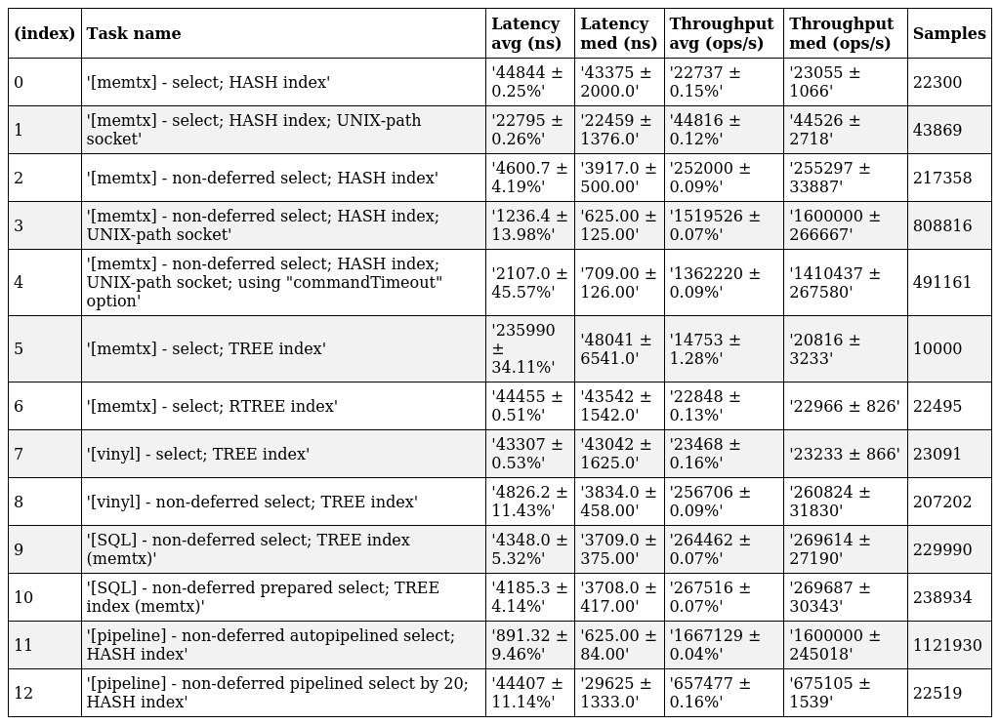

# Performance optimization guide

- Consider connecting to Tarantool server via an UNIX-socket path. Benchmark shows that it could double the performance (more throughput, less latency) than connection to a basic `host:port`.
- Increase `sliderBufferInitialSize` option if you are facing a high-frequency or big (for example: large `.insert()` tuple, long multi-part indexes for `.select()`, etc) requests.
- Set `enableAutoPipelining` option to `true`. This approach may significantly improve the performance by 2-4 times with a small trade-off in the form of a bit increased query execution time (just a several milliseconds usually).
    - This works by collecting request's buffers and not sending them immediately to server. Instead of this, connector stores the pending buffers, waits till the next tick, concatenates all the data and sends it in a big single batch.
    - You may also use `.pipeline()` and `.exec()` to manually control which data should be sent in a single batch and which not. In this case the requests latency will not be increased <i>(because there will be no dispatching to the next tick)</i> and your code will benefit from less calls to `socket.write()`
    - This approach was gently borrowed from [ioredis - read more](https://github.com/redis/ioredis?tab=readme-ov-file#autopipelining).
- Don't set `tupleToObject` and `commandTimeout` options to `true` unless it is reasonable.
    - However, `commandTimeout` has a low overhead due to the usage of `FastTimer` and is very usable in the fact that it can help you rejecting long-running requests, which may have been stale due to the network connection issue. So use this advice with caution.

## "Show me the difference"
- Here is a table which illustrates the significance of some of the possible optimization methods:

